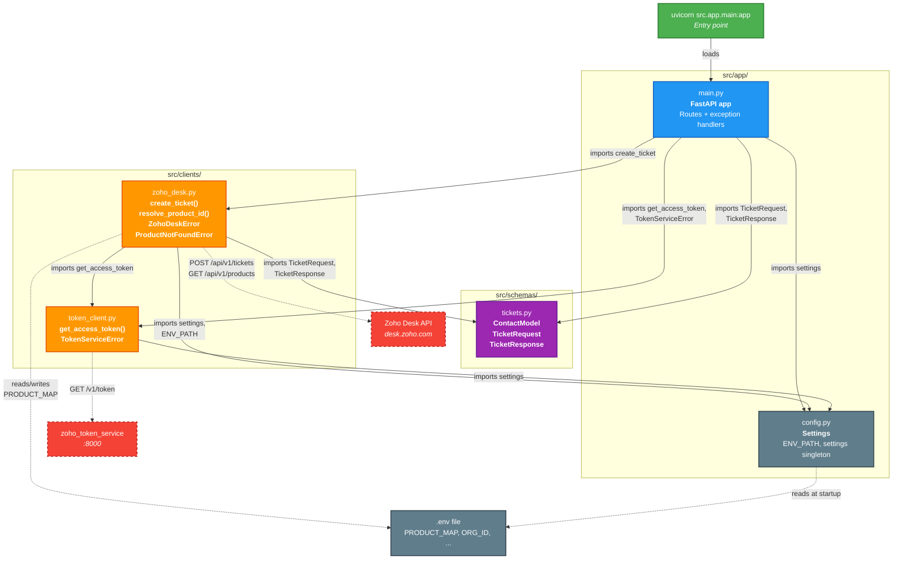
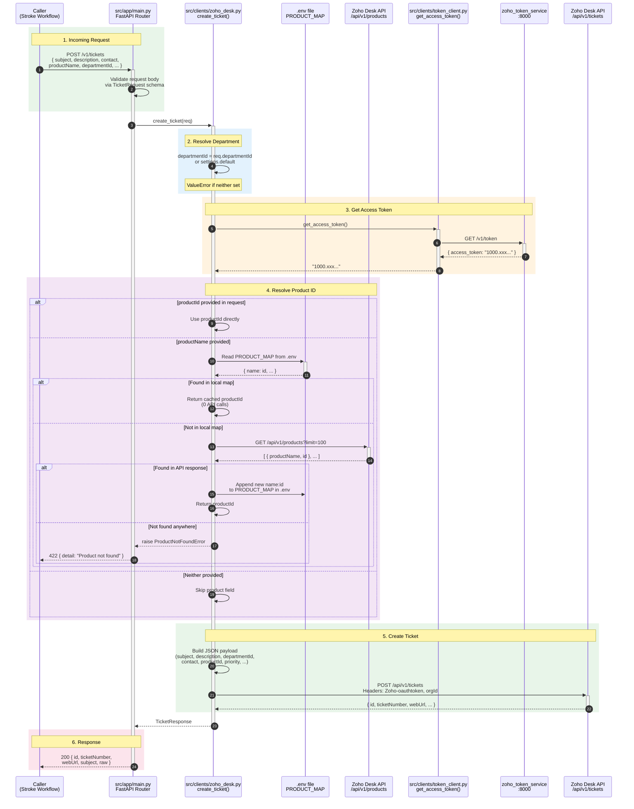
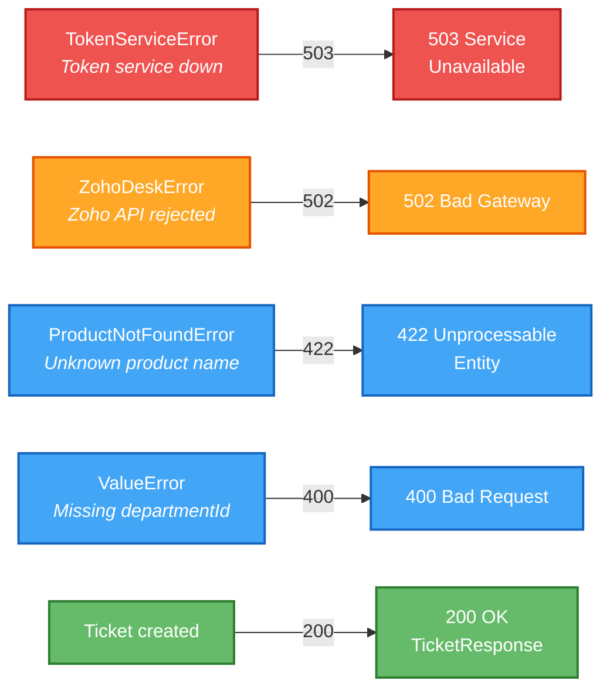

# microservice-create-zoho-desk-ticket

Microservice that creates Zoho Desk tickets via the Zoho Desk REST API.

## Architecture

### Module Dependency & Import Graph

Every module, what it exports, and how they connect to serve the main objective: **accept a JSON request and create a Zoho Desk ticket**.



### Request Lifecycle — Ticket Creation

Full lifecycle from the moment a caller hits `POST /v1/tickets` to the Zoho Desk ticket appearing in the UI.



### Error Handling

How exceptions bubble up from the clients to the caller as meaningful HTTP status codes.



## Prerequisites

- Python 3.12+
- [uv](https://docs.astral.sh/uv/) package manager
- The **zoho_token_service** running locally (provides Zoho OAuth access tokens)

## Setup

```bash
cp .env.example .env
# Fill in ZOHO_DESK_ORG_ID (required) and ZOHO_DESK_DEFAULT_DEPARTMENT_ID (optional)
uv sync
```

## Run

```bash
uv run uvicorn src.app.main:app --host 0.0.0.0 --port 8100 --workers 1
```

Interactive docs at `http://127.0.0.1:8100/docs`.

## Environment Variables

| Variable | Required | Default | Description |
|---|---|---|---|
| `ZOHO_TOKEN_SERVICE_URL` | No | `http://127.0.0.1:8000/v1/token` | URL of the centralised token service |
| `ZOHO_DESK_BASE` | No | `https://desk.zoho.com` | Zoho Desk API base URL |
| `ZOHO_DESK_ORG_ID` | **Yes** | -- | Zoho organisation ID (sent as `orgId` header) |
| `ZOHO_DESK_DEFAULT_DEPARTMENT_ID` | No | -- | Fallback department ID if not provided in request |
| `HTTP_TIMEOUT_SECONDS` | No | `30` | Timeout for outgoing HTTP calls |
| `LOG_LEVEL` | No | `INFO` | Logging level |
| `PRODUCT_MAP` | No | -- | Comma-separated `name:id` pairs for product resolution |

## API

### `POST /v1/tickets`

Create a Zoho Desk ticket.

```bash
curl -X POST http://127.0.0.1:8100/v1/tickets \
  -H "Content-Type: application/json" \
  -d '{
    "subject": "Code Stroke Alert - Test",
    "description": "<p>Test ticket</p>",
    "contact": {"lastName": "Test Patient"},
    "productName": "Code Stroke Alert"
  }'
```

**Request body fields:**

| Field | Type | Required | Notes |
|---|---|---|---|
| `subject` | string | Yes | Ticket subject |
| `description` | string | Yes | HTML or plain-text body |
| `contact` | object | Yes | Must include `lastName`; optional `firstName`, `email`, `phone` |
| `departmentId` | string | No | Falls back to `ZOHO_DESK_DEFAULT_DEPARTMENT_ID` |
| `productId` | string | No | Zoho product ID (preferred -- skips lookup) |
| `productName` | string | No | Human-readable name -- resolved to `productId` via `PRODUCT_MAP` or Zoho API |
| `channel` | string | No | e.g. `"Phone"`, `"Email"`, `"SMS"` |
| `priority` | string | No | e.g. `"High"`, `"Low"` |
| `status` | string | No | e.g. `"Open"`, `"Escalated"` |
| `phone` | string | No | Customer phone |
| `email` | string | No | Customer email |
| `category` | string | No | Ticket category |
| `classification` | string | No | Ticket classification |
| `extra` | object | No | Arbitrary key-value pairs merged into the Zoho payload |

**Response:**

```json
{
  "id": "1166045000006881756",
  "ticketNumber": "6846",
  "webUrl": "https://desk.zoho.com/support/webzter/ShowHomePage.do#Cases/dv/1166045000006881756",
  "subject": "Code Stroke Alert - Test",
  "raw": { }
}
```

### `GET /v1/healthz`

Returns `{"status": "ok"}`.

### `GET /v1/readyz`

Checks connectivity to the token service. Returns 200 or 503.

## Product Resolution

The `PRODUCT_MAP` in `.env` stores a local `name:id` mapping so most requests resolve products with **zero API calls**:

```
PRODUCT_MAP="Code Stroke Alert:1166045000001146278,Amendments:1166045000001146306,..."
```

If a `productName` is not found in the local map, the service fetches the full product list from `GET /api/v1/products`, resolves the ID, and **auto-appends** the new mapping to `.env` so future requests are instant. You can also hand-edit `.env` at any time -- changes are picked up on the next request without restarting.
